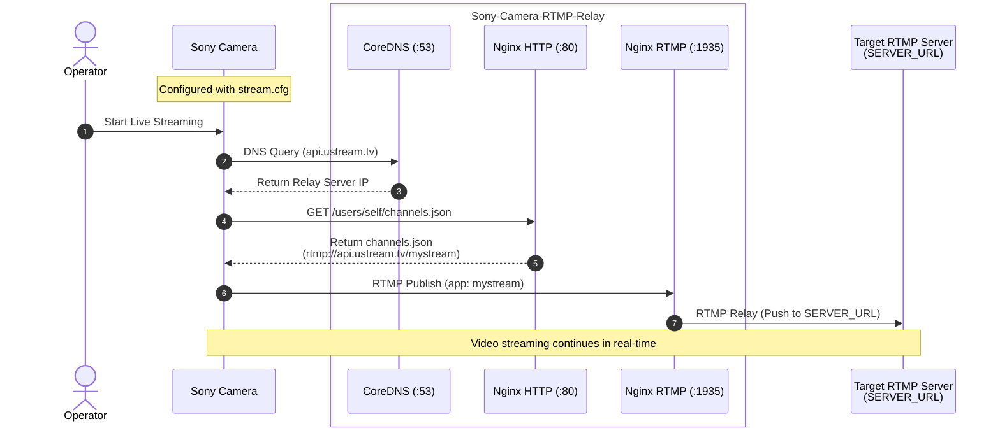

# Sony-Camera-RTMP-Relay
This is containers for Sony Camera RTMP Relay. We use it for DJ Production.  
We are running this container on a Kubernetes cluster. For more information on operating with Kubernetes, see [TechnoTUT/Infra](https://github.com/TechnoTUT/Infra).

## Architecture



## Special Thanks
Thanks to ma1co/OpenMemories and the following issues for giving us the knowledge.  
https://github.com/ma1co/OpenMemories-Tweak/issues/224

## Supported Cameras
Sony HDR-CX680  
Other cameras might work.

## How to use
### 1. Install Sony-PMCA-RE
You prepare Windows PC and install Sony-PMCA-RE.  
Download from https://github.com/ma1co/Sony-PMCA-RE/releases  

### 2. Write "fake credentials" to your camera
Download `stream.cfg` and write the file to the camera using Sony-PMCA-RE.  
You can use the following command to write the file to the camera.
```powershell
curl https://raw.githubusercontent.com/TechnoTUT/sony-camera-rtmp-relay/refs/heads/main/stream.cfg -o stream.cfg
pmca-console-v0.18-win.exe stream -w stream.cfg
```
### 3. Configure your network
Configure your DHCP server.
Change the DNS server address to the server's IP address.

### 4. Clone this repository
```bash
git clone https://github.com/technotut/sony-camera-rtmp-relay.git && cd sony-camera-rtmp-relay
```

### 5. Configure environment variables
Copy `.env.example` to `.env` and edit it to match your network settings:
```bash
cp .env.example .env
vi .env
```
Key configuration items:
- `SERVER_URL`: Destination RTMP server URL (e.g., `rtmp://<target-ip>:1935/live/test`).
- `RELAY_IP`: IP address of this relay host reachable from the camera (resolves `api.ustream.tv`).
- `UPSTREAM_DNS`: Upstream DNS server for forwarding non-target queries (defaults to `1.1.1.1`).
- `HTTP_PORT`, `RTMP_PORT`, `DNS_PORT`: (Optional) Host port mappings.

### 6. Start the containers
```bash
docker compose up -d
```
No image rebuild is required when changing IPs or stream URLs; CoreDNS and Nginx read the configuration directly from environment variables.

You want local streaming server, you can use [TechnoTUT/rtmp-live-server](https://github.com/TechnoTUT/rtmp-live-server).

If you want to stop the containers, you can use the following command:
```bash
docker compose down
```

### 7. Start streaming
Start streaming from your camera.  
If you use [TechnoTUT/rtmp-live-server](https://github.com/TechnoTUT/rtmp-live-server), you can check the streaming status by accessing the `http://<rtmp-live-server_IPaddress>/stat`.  

### Optional: Use Podman
If you are using Red Hat Enterprise Linux (or RHEL clones such as Alma Linux or Rocky Linux) and want to use this repository, you may want to work with Podman.  
To make it work with Podman, do the following:  
```bash
## Install Podman, pip, and git
sudo dnf install -y podman podman-plugins python3-pip git
## Install podman-compose
## ## If you added EPEL repository, you can use "sudo dnf install -y podman-compose" instead of the following command. 
pip3 install podman-compose 
## Clone this repository
git clone https://github.com/technotut/sony-camera-rtmp-relay.git && cd sony-camera-rtmp-relay
## Configure environment variables
cp .env.example .env
vi .env
## Start the containers
podman-compose up -d
```
If you want to automatically start the containers when the system starts, you can use the following command.
```bash
## Enable linger for the user
## Replace <username> with your username
sudo loginctl enable-linger <username>
## Generate a systemd service file
podman-compose systemd -a create-unit
## Create service files and paste the generated service file
sudo vi /etc/systemd/user/podman-compose\@.service
## Enable and start the service
systemctl --user enable --now podman-compose@
```
For more information on podman-compose and systemd, please refer to the following links:  
https://www.it-hure.de/2024/02/podman-compose-and-systemd/
